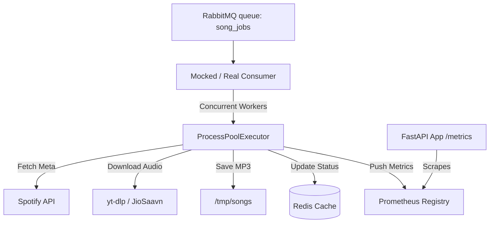

# SongSnatch Worker

An asynchronous background worker queue and processing system for **SongSnatch**. It consumes download tasks from RabbitMQ, fetches track metadata, downloads audio, stores completion state in Redis, and exposes Prometheus metrics.

---

## Architecture Overview



- **Consumer (`consumer.py`)**: Runs multiple parallel worker processes (via `ProcessPoolExecutor`) to subscribe to the RabbitMQ queue `song_jobs`, process requests, download files, and ack/nack messages.
- **FastAPI Core (`main.py`)**: Serves the application router and exposes a `/metrics` Prometheus scraping endpoint.
- **CLI Tool (`cli.py`)**: A command-line companion powered by `typer` to query tracks, list downloaded songs, and locate audio files.
- **Benchmark Suit (`benchmark/`)**: Tools to test throughput and reliability under simulated worker delays.

---

## Benchmark Results

Below are the latest results from running the queue benchmark suite:

| Metric | Value |
| :--- | :--- |
| **Total Jobs Processed** | 100 / 100 |
| **Total Time Taken** | 8.842 seconds |
| **Throughput** | 11.31 jobs/second |
| **Active Workers** | 5 (Process Pool Executor) |
| **Mock Download Delay** | 0.05 seconds per song |

---

## How to Run the Benchmark

Ensure you have a local or remote Redis instance and RabbitMQ server running, and have your `.env` configured.

1. **Activate the Virtual Environment**:
   ```bash
   .venv\Scripts\activate
   ```

2. **Execute the Benchmark Script**:
   ```bash
   python benchmark/run_benchmark.py [num_jobs]
   ```
   *Replace `[num_jobs]` with the number of mock tasks you'd like to test (defaults to 100).*

---

## How to Start the Worker

To start the consumer pool:
```bash
python consumer.py
```

To run the FastAPI metrics daemon:
```bash
python main.py
```
